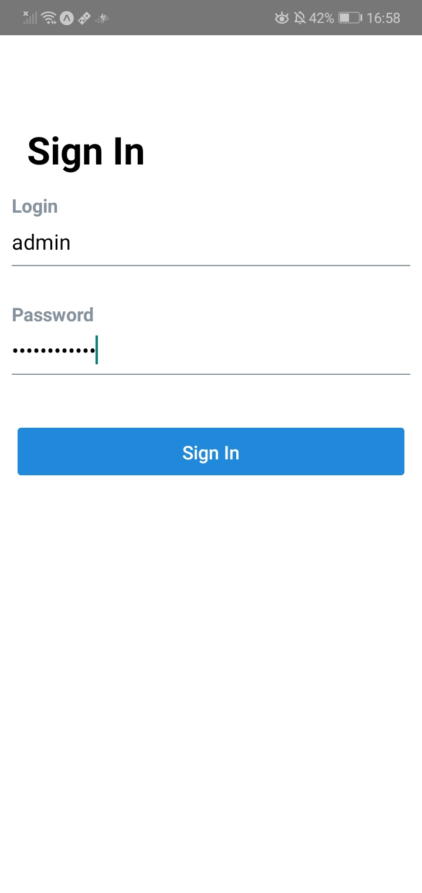
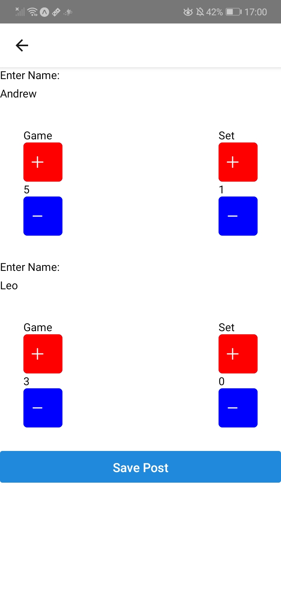

# Scores Display

### CURRENTLY CHANGING SCORES TO BE REALTIME AND UPDATING THE STYLES. APP WILL BE RELEASED BY THE START OF SPRING SEMESTER

An early stage of an app to display match scores of Dickinson men's tennis team. The release of the app was delayed due to the outbreak. I anticipate to publish it by the start of the fall season. App is developed using React Native and Expo CLI

To start the app use `expo start`

Scores Display uses a custom Express API to connect to MongoDB.  https://github.com/sorkinl/Scores-server

                                    
